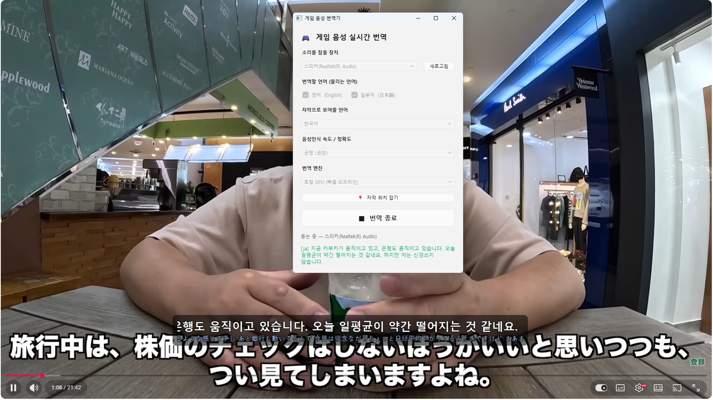
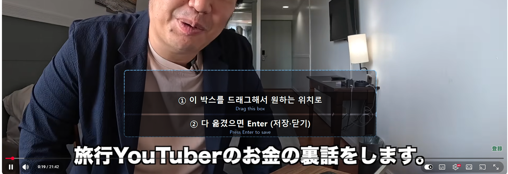

# Game Voice Translator — 게임 음성 실시간 번역 자막

<p>
  
  
  
  
  
</p>

게임·음성 통화에서 나오는 **상대방의 영어/일본어 음성을 실시간으로 인식 → 번역 → 화면 위 자막**으로 띄워주는 데스크톱 도구.
마이크가 아니라 **PC가 재생 중인 소리(WASAPI 루프백)** 를 캡처하므로, 헤드셋으로 듣는 상대 목소리를 그대로 자막화한다.
음성인식과 번역이 모두 **로컬 GPU에서 오프라인**으로 돌아간다 (번역 모델이 없으면 Google 번역으로 자동 대체).

<p align="center">
  
</p>
<p align="center"><sub>일본어 유튜브 영상을 재생하며 실행한 화면. 오른쪽 제어판이 인식 언어를 <code>[ja]</code>로 감지해 번역문을 표시하고, 영상 하단에 반투명 자막 오버레이(번역문 + 원문)가 얹혀 있다.</sub></p>

<p align="center">
  
</p>
<p align="center"><sub><b>자막 위치 잡기</b> 모드. 점선 박스를 드래그해 자막이 뜰 자리를 정하고 Enter를 누르면 위치가 저장되어 다음 실행부터 그 자리에 뜬다. 게임마다 UI가 가리지 않는 곳을 고를 수 있다.</sub></p>

## 파이프라인

```
 스피커 출력(WASAPI loopback)
        │  0.1초 블록
        ▼
 ┌───────────────┐   말소리 구간만   ┌───────────────┐  텍스트+언어  ┌────────────────┐  번역문  ┌──────────────┐
 │ Segmenter(VAD)│ ───────────────▶ │  Transcriber  │ ───────────▶ │   Translator   │ ──────▶ │   Overlay    │
 │ RMS 임계·무음  │  큐(최대 3개)    │ faster-whisper│  en/ja 필터  │ NLLB-200 (CT2) │  사전보정 │ PyQt6 항상위  │
 └───────────────┘                  └───────────────┘              └────────────────┘         └──────────────┘
    audio_capture.py                  transcriber.py                 translators.py             overlay.py
    vad_segmenter.py                  (백그라운드 스레드)              glossary.py                gui.py / main.py
```

| 파일 | 역할 |
|------|------|
| `audio_capture.py` | `soundcard`로 WASAPI 루프백 장치를 열어 16 kHz 모노 블록을 뽑아낸다 |
| `vad_segmenter.py` | RMS 에너지 기반 음성 구간 감지. 짧은 효과음은 버리고, 너무 긴 발화는 강제로 끊는다 |
| `transcriber.py` | `faster-whisper`(large-v3, float16) 워커 스레드. 대기 큐가 밀리면 오래된 세그먼트를 버려 지연 누적을 막는다 |
| `translators.py` | 번역 백엔드 — `LocalBackend`(NLLB-200 → CTranslate2 변환본, GPU) / `GoogleBackend`(deep-translator) |
| `glossary.py` | 게임 슬랭 사전. 번역 전 `gg→good game`처럼 풀어 쓰고, 번역 후 어색한 한국어를 교정한다 |
| `overlay.py` | 항상 위·클릭 통과·반투명 자막 창. 외곽선 텍스트, 줄별 TTL, 드래그로 위치 지정 |
| `pipeline.py` | 위 요소를 스레드로 연결하고 시작/정지를 관리 |
| `gui.py` / `main.py` | PyQt6 제어판(GUI) / CLI 진입점 |
| `config.py` | 장치·언어·모델·자막 설정을 한곳에 |

## 설계에서 신경 쓴 점

- **지연 관리** — STT는 실시간보다 느릴 수 있으므로 대기 큐 상한(`MAX_PENDING_SEGMENTS`)을 두고 넘치면 오래된 음성을 버린다. 자막이 계속 밀리는 것보다 몇 마디 놓치는 편이 게임 중엔 낫다.
- **오인식 억제** — Whisper의 언어 감지 확률로 허용 언어(en/ja) 외 소리를 걸러, 게임 효과음·한국어 팀 보이스가 엉뚱한 자막으로 뜨지 않게 했다.
- **번역 품질 vs 비용** — 무료·오프라인을 유지하면서 품질을 올리기 위해 NLLB에 슬랭 사전 보정을 얹었다. `glossary_ab_test.json`에 사전 ON/OFF 비교 결과가 있다.
- **NLLB의 문장 끝 누락 교정** — `length_penalty`를 올려 뒷부분이 잘리는 버릇을 완화했다.
- **오버레이** — 전체화면 게임 위에서도 보이도록 `WindowStaysOnTop` + `WindowTransparentForInput`, 게임 조작을 방해하지 않는다.

## 기술 스택

Python · faster-whisper (CTranslate2) · NLLB-200 · transformers/sentencepiece · soundcard (WASAPI) · PyQt6 · NumPy · CUDA

## 설치

```bash
py -3.14 -m venv .venv
.venv\Scripts\activate
pip install -r requirements.txt
```

### 로컬 GPU 번역 모델 준비 (한 번만)

로컬 번역(기본값)을 쓰려면 NLLB 모델을 CTranslate2 형식으로 변환해야 한다.
이미 `models/nllb-200-distilled-600M-ct2/` 가 있으면 건너뛴다.

```bash
ct2-transformers-converter --model facebook/nllb-200-3.3B ^
  --output_dir models/nllb-200-3.3B-ct2 --quantization float16
```

3.3B는 최고 품질(3090이면 여유). 더 가볍게 쓰려면 `facebook/nllb-200-1.3B`나
`facebook/nllb-200-distilled-600M`으로 변환하고 `config.py`의
`TRANSLATION_MODEL`/`TRANSLATION_CT2_DIR`만 맞춰주면 된다.

모델이 없으면 자동으로 Google 번역(네트워크)으로 대체된다.

## 실행 — 프로그램(GUI)

가장 쉬운 방법. 터미널 필요 없음.

- **바탕화면의 `게임 음성 번역기` 아이콘**을 더블클릭, 또는
- 폴더의 **`게임 음성 번역기.vbs`** 더블클릭 (콘솔 없이 GUI만 뜸)
- 문제가 생겨 로그를 보고 싶으면 **`디버그_실행.bat`** (콘솔에 로그 표시)

GUI 사용법:
1. **소리를 잡을 장치** 선택 (헤드셋/스피커/디스코드 등)
2. **번역할 언어** 체크 (영어 / 일본어)
3. **자막으로 보여줄 언어** 선택 (기본: 한국어)
4. (선택) **자막 위치 잡기** → 드래그로 옮기고 닫으면 저장
5. **번역 시작** → 현재 나오는 소리를 듣고 자막을 띄움. **번역 종료**로 멈춤

> 첫 시작 때만 음성인식 모델을 메모리에 올리느라 잠깐(수십 초) 걸린다.

## 실행 — 터미널(CLI, 선택)

```bash
python main.py --list-devices       # 캡처 가능한 장치 확인
python main.py                       # 기본 스피커 소리 → 한국어 자막
python main.py --device Discord      # 디스코드 소리만
python main.py --place               # 자막 위치 잡기
python main.py --target en --no-overlay   # 영어 자막 / 콘솔만
```

종료: 콘솔에서 `Ctrl+C` (또는 창 닫기).

## 깨끗한 음성을 위한 팁

- **가장 깨끗한 방법**: 보이스를 Discord 같은 별도 앱으로 받고 `--device Discord`로
  그 앱 소리만 캡처. 게임 효과음이 안 섞인다.
- 인게임 보이스밖에 없으면 게임 소리 전체가 잡혀 효과음 노이즈가 섞인다.
  VAD가 상당수 걸러주지만 완벽하진 않다.

## 튜닝 (`config.py`)

| 값 | 설명 |
|----|------|
| `RMS_THRESHOLD` | 자막이 너무 자주 뜨면(노이즈) ↑, 작은 말소리를 놓치면 ↓ |
| `SILENCE_END_SEC` | 문장을 끊는 무음 길이. 자막이 늦으면 ↓ |
| `MODEL_SIZE` | 기본 `large-v3`(가장 정확·노이즈 강함). 빠르게=`medium`/`small` |
| `DECODE_BEAM` | STT 빔 크기(기본 5). 빠르게=1, 정확하게=5~8 |
| `TRANSLATOR` | `local`(GPU/NLLB, 빠름·오프라인) 또는 `google`(네트워크) |
| `TRANSLATION_MODEL` | 로컬 번역 모델 (기본 NLLB-3.3B). 가볍게=1.3B/600M |
| `MAX_PENDING_SEGMENTS` | 자막이 계속 밀리면 ↓ (오래된 음성을 더 적극적으로 버림) |
| `ALLOWED_LANGS` | 인식할 소스 언어 (기본 `["en","ja"]`). 이 외 언어(한국어 등)는 무시 |
| `MIN_LANG_PROB` | 자막이 엉뚱하게 뜨면 ↑ (예 0.6), 영어/일본어를 놓치면 ↓ |
| `SOURCE_LANG` | 상대 언어가 하나로 고정이면 `"en"`/`"ja"` (자동감지보다 안정적) |
| `TARGET_LANG` | 내가 읽을 언어 |

## 알려진 한계 (MVP)

- 전체화면 **독점(exclusive fullscreen)** 게임에선 오버레이가 안 보일 수 있음
  → 게임을 **테두리 없는 창모드(borderless)** 로 설정.
- 게임 효과음과 보이스가 한 출력에 섞이면 오인식 발생 가능.
- 화자 구분(누가 말했는지)은 아직 없음.
